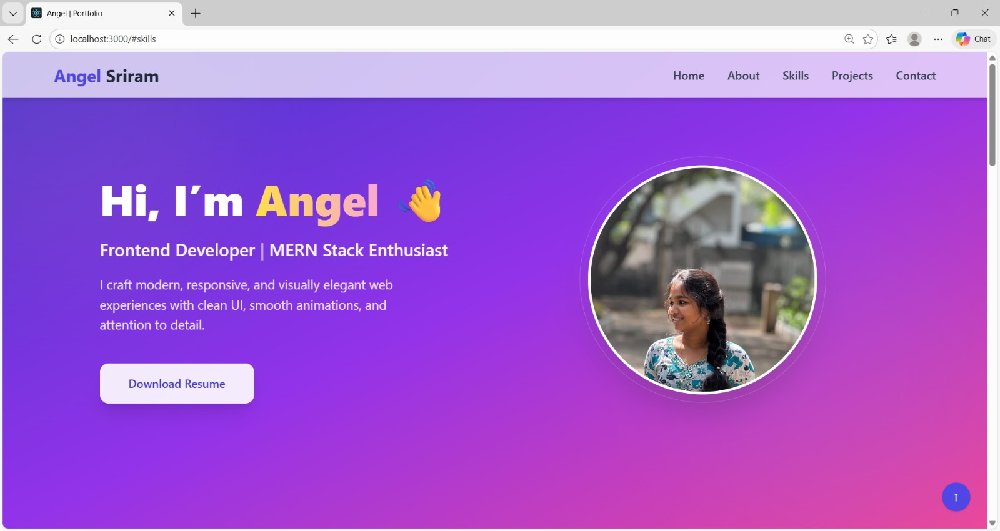
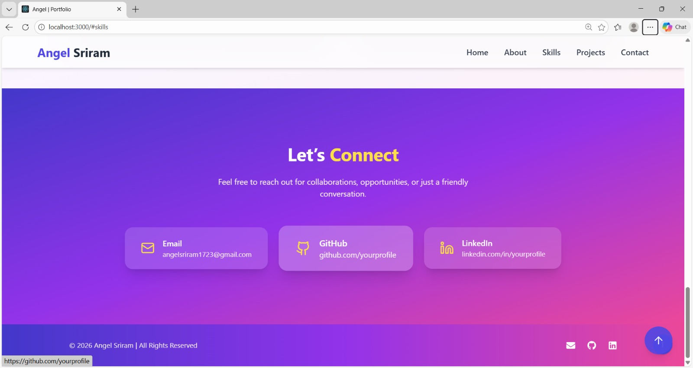

# 🌐 Personal Portfolio Website – React

A responsive and animated personal portfolio website built using **React.js**, **Tailwind CSS**, and **Framer Motion** as part of my **MERN Stack Internship Task

---

## ✨ Features

- Single-page React application
- Component-based architecture
- Fully responsive design (Mobile / Tablet / Desktop)
- Smooth animations using Framer Motion
- Modern UI built with Tailwind CSS
- Sticky navigation bar
- Hover effects and smooth scrolling
- Download Resume button
- Social media profile links
- Clean and user-friendly layout

---

## 🛠️ Technologies Used

- React.js
- JavaScript (ES6)
- Tailwind CSS
- Framer Motion
- HTML & CSS
- Git & GitHub

---

## 📂 Sections Included

- **Home** – Introduction and hero section  
- **About Me** – Personal background and summary  
- **Skills** – Technical skills with modern UI  
- **Projects** – Project details with cards  
- **Contact** – Contact information and social links  

---

## 🎞️ Animations & UI Effects

- Page and section load animations
- Smooth scrolling between sections
- Hover effects on buttons and cards
- Framer Motion animations for a smooth user experience

---

## 📸 Screenshots

### 🖥️ Desktop View

### 📱 Mobile View

### 🎞️ Animation Preview

---
//Author
Angel Sriram